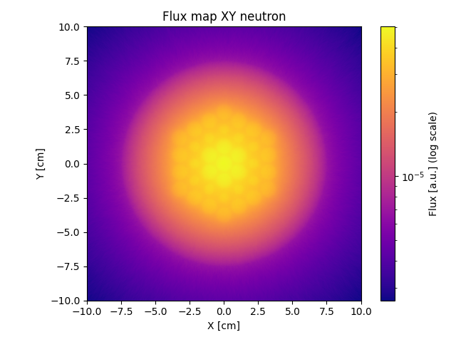
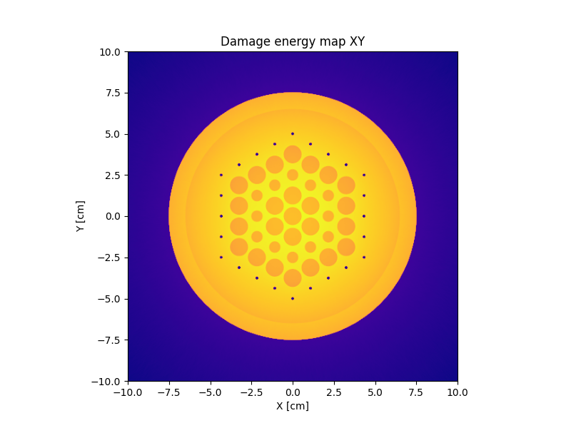

# OpenMC Python Project

**open-mc-project** is a modular Python project for simulating nuclear reactor physics using [OpenMC](https://openmc.org/). It provides tools for modeling reactor geometries, defining materials, running criticality calculations, and analyzing results with custom utilities for pre- and post-processing. The project is organized for extensibility and reproducibility, supporting studies such as fission rate analysis, gamma camera simulations, and radioprotection.

---

## Project Structure

```
.
├── parameters/                # Material and cross-section parameter definitions
├── lib/                       # Cross-section data and conversion factors
├── src/
│   ├── models/                # Core geometry and reactor models
│   ├── studies/               # Simulation studies and analysis notebooks
│   └── utils/                 # Pre- and post-processing utilities
└── README.md
```

---

## Key Components

- **Material and Geometry Definitions**
  - [`parameters/parameters_materials.py`](parameters/parameters_materials.py): Material definitions (e.g., `FUEL_MATERIAL`, `HELIUM_MATERIAL`).
  - [`src/models/model_hexagon_lattice_fuel.py`](src/models/model_hexagon_lattice_fuel.py): Hexagonal lattice geometry and main cell.
  - [`src/models/model_complete_reactor.py`](src/models/model_complete_reactor.py): Full reactor core model.

- **Cross Section Data**
  - [`parameters/parameters_paths.py`](parameters/parameters_paths.py): Path to cross section XML file.
  - [`lib/cross_sections/cross_sections.xml`](lib/cross_sections/cross_sections.xml): Main cross section data for OpenMC.

- **Simulation Scripts**
  - [`src/studies/lattice_fuel/core.py`](src/studies/lattice_fuel/core.py): Main entry point for lattice fuel simulations, including geometry export, plotting, and criticality calculations.
  - [`src/studies/lattice_fuel/radiopro_mini_core/radiopro_core.py`](src/studies/lattice_fuel/radiopro_mini_core/radiopro_core.py): Specialized script for radioprotection studies.
  - [`src/studies/simulation_cs_137/note_book/cesium_simulation.ipynb`](src/studies/simulation_cs_137/note_book/cesium_simulation.ipynb): Cesium-137 gamma simulation notebook.
  - [`src/studies/simulation_gamma_detector/note_book/detector_gamma.ipynb`](src/studies/simulation_gamma_detector/note_book/detector_gamma.ipynb): Gamma detector simulation notebook.

- **Utilities**
  - [`src/utils/pre_processing/pre_processing.py`](src/utils/pre_processing/pre_processing.py): Geometry creation, mesh tally setup, and result cleanup.
  - [`src/utils/post_preocessing/post_processing.py`](src/utils/post_preocessing/post_processing.py): Loading and analyzing tally results.

---

## Getting Started

### Prerequisites

- Python 3.8+
- [OpenMC](https://docs.openmc.org/en/stable/)
- NumPy, Matplotlib, Pillow

### Running a Simulation

1. Clone the repository and install dependencies.
2. Set up your cross-section data as described in [`parameters/parameters_paths.py`](parameters/parameters_paths.py).
3. Run a study script, e.g.:
   ```sh
   python src/studies/lattice_fuel/core.py
   ```
4. Explore results and figures in the output directory.

---

## Figures and Results

Below are example results generated by the project, illustrating typical outputs such as geometry plots, mesh tallies, detector spectra, and advanced studies.

### 1. Hexagonal Lattice Fuel Geometry & Neutron Flux



*Figure 1: Visualization of the hexagonal lattice fuel geometry and neutron flux mesh as defined in [`model_hexagon_lattice_fuel.py`](src/models/model_hexagon_lattice_fuel.py).*

### 2. Damage Energy Mesh Tally



*Figure 2: Damage energy tally results visualized using the post-processing utilities ([`load_dammage_energy_tally`](src/utils/post_preocessing/post_processing.py)).*

### 3. Gamma Camera Simulation


*Figure 3: Simulated gamma camera response (energy spectrum by multiplicity) for a selected reactor configuration ([`model_gamma_camera.py`](src/models/model_gamma_camera.py)).*

### 4. Cesium-137 Gamma Spectrum


*Figure 4: Simulated gamma spectrum for Cesium-137 source ([`cesium_simulation.ipynb`](src/studies/simulation_cs_137/note_book/cesium_simulation.ipynb)).*

### 5. Gamma Detector Pulse-Height Spectrum


*Figure 5: Pulse-height tally spectrum from gamma detector simulation ([`detector_gamma.ipynb`](src/studies/simulation_gamma_detector/note_book/detector_gamma.ipynb)).*

### 6. Fission Rate Study


*Figure 6: Fission rate per second as a function of core parameters ([`fission_rate_per_sec.ipynb`](src/studies/fission_rate_study/fission_rate_per_sec.ipynb)).*

### 7. MOX Enrichment Study
---

## How Results Are Produced

- **Geometry and Materials:**  
  Defined in Python scripts and exported to OpenMC XML using the API.
- **Simulation:**  
  Run with OpenMC, using custom settings and tallies for each study.
- **Post-processing:**  
  Results are loaded and visualized using utilities in [`src/utils/post_preocessing/post_processing.py`](src/utils/post_preocessing/post_processing.py), producing figures like those above.

---

## License

This project is licensed under the MIT License. See [LICENSE](LICENSE) for details.

---